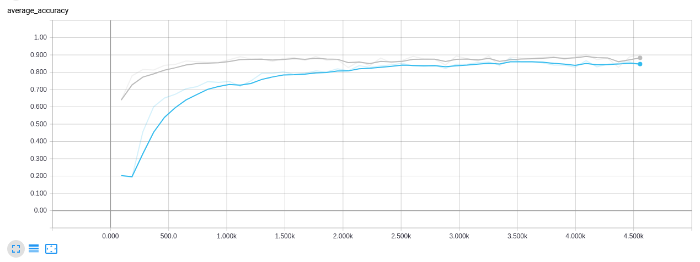

# Using Guild AI

You can use Guild AI with this project to reproduce and compare
results.

- Automate model operations
- Capture run results
- Compare loss and test accuray
- View run logs with TensorBoard

Contents:

- [Setup](#setup)
- [Review project](#review-project)
- [Results on small NORB](#results-on-small-norb)
- [CapsNet vs baseline CNN](#capsnet-vs-baseline-cnn)
- [Experiment with parameters](#experiment-with-parameters)

## Setup

### Install Guild AI

Install Guild AI using pip:

``` bash
$ pip install guildai
```

**NOTE** &nbsp; You may need to use `sudo pip install guildai` to
install Guild AI at the system level. Alternatively, use `pip install
guildai --user` to install it to your user directory.

### Clone project

If you haven't already cloned the project repository, run:

``` bash
$ git clone https://github.com/gar1t/Matrix-Capsules-EM-Tensorflow.git
```

### Initialize environment

We recommend running Guild commands in a virtual environment.

Initialize an environment from the project directory:

``` bash
$ cd Matrix-Capsules-EM-Tensorflow
$ guild init -p python3
```

This creates an environment `env` in the current directory that uses
Python 3. It also installs TensorFlow and the packages listed in
`requirements.txt`.

### Activate environment

Before running Guild commands in an environment, activate it
using the `source` command:

``` bash
$ source guild-env
```

Note that the command prompt changes to include the environment name
in the format `(Matrix-Capsules-EM-Tensorflow) <old prompt>`. Use this
to verify that your environment is activated.

### Check Guild

When an environment is activated, check the environment by running:

``` bash
$ guild check
```

If you get errors and cannot resolve them, try getting more
information by using the `--verbose` option:

``` bash
$ guild check --verbose
```

To get help, open an issue on the [Guild AI issue
tracker](https://github.com/guildai/guildai/issues).

## Review project

Before running operations, review the project by listing available
models, operations, and viewing project help.

All of the project information displayed below is defined in
[guild.yml](guild.yml).

**NOTE** &nbsp; The steps below must be run from the project directory.

List project models:

``` bash
$ guild models
```

Guild shows three models:

```
./baseline    Baseline CNN
./capsnet     CapsNet model
./small-norb  Support for small NORB dataset
```

`baseline` and `capsnet` represent the networks we train and
evaluate. `small-norb` represents the small NORB dataset, which we
prepare for use in training and test.

Each model supports one or more operations.

List available operations:

``` bash
$ guild ops
```

Guild shows the available operations:

```
./baseline:evaluate   Evaluate trained baseline CNN
./baseline:train      Train baseline CNN
./capsnet:evaluate    Evaluate trained CapsNet
./capsnet:train       Train CapsNet
./small-norb:prepare  Prepare small NORB for training
```

Each operation is run using the command form `guild run
MODEL:OPERATION`.

You can run operations to reproduce results and conduct your own
experiments. Refer to the sections below for help with various
scenarios.

- [Reproduce CapsNet results on small NORB](#results-on-small-norb)
- [Compare CapsNet to baseline CNN](#capsnet-vs-baseline-cnn)
- [Experiment with parameters](#experiment-with-parameters)

## Results on small NORB

The steps below reproduce the results reported in [README.md](README.md).

Ensure that you have followed the steps for [Setup](#setup) above
before continuing.

**NOTE** &nbsp; The steps below must be run from the project
directory in an activated environment.

### Prepare small NORB dataset

Before training CapsNet on small NORB, run the `small-norb:prepare`
operation as follows:

``` bash
$ guild run small-norb:prepare
```

Press `Enter` to confirm and start the operation.

Guild automatically downloads the required [small NORB
data](https://cs.nyu.edu/~ylclab/data/norb-v1.0-small/) and uses the
[data/smallNORB](data/smallNORB.py) module to generate TF Records used
for both training and test.

Once the small NORB dataset is prepared, it is used for `train` and
`evaluate` operations whenever `dataset=smallNORB` is specified.

Use `guild runs` to list available runs:

``` bash
$ guild runs
```

Guild shows the prepared dataset run (run ID and date will differ):

```
[1:4438aa1a]  ./small-norb:prepare  2018-11-15 07:06:29  completed
```

Each run is stored in a separate directory used to isolate run inputs
and outputs, letting you track each experiment separately.

Use `guild ls` to list files associated with the latest run:

``` bash
$ guild ls
```

Guild shows the list of files for the `prepare` run:

```
smallNORB/
smallNORB/smallnorb-5x01235x9x18x6x2x96x96-testing-cat.mat
smallNORB/smallnorb-5x01235x9x18x6x2x96x96-testing-dat.mat
smallNORB/smallnorb-5x46789x9x18x6x2x96x96-training-cat.mat
smallNORB/smallnorb-5x46789x9x18x6x2x96x96-training-dat.mat
test0.tfrecords
train0.tfrecords
```

The `*.mat` files are downloaded from
[https://cs.nyu.edu/~ylclab/data/norb-v1.0-small/](https://cs.nyu.edu/~ylclab/data/norb-v1.0-small/)
and the `*.tfrecords` files are generated by
[data/smallNORB](data/smallNORB.py).

Use `guild ls -f` to show the full path to each file.

Guild supports a number of run management commands. Use `--help` with
any command to get help. For example:

``` bash
$ guild runs --help
```

For a list of top-level commands, run:

``` bash
$ guild --help
```

### Train CapsNet on small NORB

With the small NORB dataset prepared, we can train the CapsNet model
using the `capsnet:train` operation. From the project directory in an
activated environment, run:

``` bash
$ guild run capsnet:train dataset=smallNORB
```

Review the flags for the operation and press `Enter` to confirm. If
you want to change any flag values, press `n` and then `Enter` and
re-run the operation using the destired flags.

For help with available flags, run:

``` bash
$ guild run capsnet:train --help-op
```

Set flag values using the form `NAME=VALUE`. For example, to train
over 5 epochs instead of the 50 (the default), run:

``` command
guild run capsnet:train dataset=smallNORB epochs=5
```

**NOTE** &nbsp; The default number of epochs is 50, which reproduces
the results in README.md. However, training over 50 epochs even on a
fast GPU can take over several hours. If you want to train in less
time, use a smaller number of epochs. Your result in this case will
not match that in README.md.

### View training in TensorBoard

You can use TensorBoard to monitor your training progress.

While CapsNet is training, open a second command console and activate
the environment:

``` bash
$ cd Matrix-Capsules-EM-Tensorflow
$ source guild-env
```

Verify that you can see the active operation by listing runs:

``` bash
$ guild runs
```

You should see these run (run IDs and dates will differ):

```
[1:55682e14]  ./capsnet:train       2018-11-15 07:42:45  running    smallNORB
[2:4438aa1a]  ./small-norb:prepare  2018-11-15 07:06:29  completed
```

Use Guild to open TensorBoard by running:

``` bash
$ guild tensorboard
```

This start TensorBoard on an available port and opens it in your
browser. Guild monitors project runs and updates TensorBoard
automatically. You can leave TensorBoard running while CapsNet trains.

**NOTE** &nbsp; If you are training on a remote server, you may want to
specify the port that TensorBoard listens to. In this case, run:

``` bash
$ guild tensorboard --port PORT
```

When running on a remote server, Guild does not open TensorBoard in
your browser. You must open the link that Guild displays in the
command prompt manually.

You can quit TensorBoard at any time by pressing `Ctrl-q` in the
command console where TensorBoard is running.

### Evaluate CapsNet

You can test CapsNet either while it is learning or after the train
operation finishes.

If `capsnet:train` is still running, open a new command console and
activate the project environment:

``` bash
$ cd Matrix-Capsules-EM-Tensorflow
$ source guild-env
```

To evaluate the model with the lastest epoch checkpoints, run:

``` bash
$ guild run capsnet:evaluate dataset=smallNORB
```

The command calculates model accuracy using the test examples
generated for the small NORB dataset.

If you are viewing project runs in TensorFlow, test accuracy is
displayed as `average_accuracy` for the applicable training epoch.

You can run `evaluate` as many times as you like. Each run is captured
as a separate experiment. You can delete runs using `guild runs
rm`. For example, to delete the latest `evaluate` operation, run:

``` bash
$ guild runs rm 1 -o evaluate
```

The value `1` indicates that you want to delete the run that appears
first in the list of matching runs, which is always the latest run.

For help with `runs rm`, use:

``` bash
$ guild runs rm --help
```

## CapsNet vs baseline CNN

You can use Guild to compare performance between CapsNet and the
baseline CNN.

If you haven't already trained and evaluated a CapsNet model, follow
the steps in [Results on small NORB](#results-on-small-norb) before
completing the steps below.

### Train baseline CNN

Train the baseline model on small NORB by running:

``` bash
$ guild run baseline:train dataset=smallNORB
```

Guild shows the default flags, which are the same default values used
for `capsnet:train`. To accept the defaults, press `Enter`.

**NOTE** &nbsp; If you trained CapsNet in the previous section, use the same
flag values when training the baseline CNN.

This starts a new run, which tracks the results of the baseline CNN
training, including saved checkpoints.

### Evaluate baseline CNN

When the baseline CNN is trained, evaluate it by running:

``` bash
guild run baseline:evaluate dataset=smallNORB
```

As with `capsnet:evaluate`, this operation captures model accuracy,
this time for the baseline CNN.

### Compare CapsNet and baseline CNN

With CapsNet and baseline CNN both trained and evaluated, use Guild
Compare to compare accuracy and loss.

``` bash
$ guild compare
```

This command launches a program that lets you browse runs and their
results.

When you're finished comparing, press `q` to exit the program.

If TensorBoard is not already running (e.g. from [View training in
TensorBoard](#view-training-in-tensorboard) above) start it now:

``` bash
$ guild tensorboard
```

Expand the **accuracy** or **average_accuracy** scalars to compare
model accuracy.

**NOTE** &nbsp; TensorBoard may take a minute or two to load all of the data
available. If you don't see all of the data you expect, wait a few
minutes. TensorBoard automatically refreshes when new data is loaded.



## Experiment with parameters

Experiment with different parameters for `train` operations.

To get project help, including available models, operations and flags,
run:

``` bash
$ guild help
```

Flags are set for an operation in the form `NAME=VALUE`. For example,
the following trains capsnet with a batch size of 32:

``` bash
$ guild run train batch_size=32
```

### Datasets

In addition to `smallNORB`, which is the default dataset used in train
operations, the following additional datasets are supported:

- `mnist`
- `fashion_mnist`
- `cifar10` (TODO)
- `cifar100` (TODO)

### Structure parameters

The following structure parameters are supported:

- `A` - Number of channels in output from ReLU Conv1
- `B` - Number of capsules in output from PrimaryCaps
- `C` - Number of channels in output from ConvCaps1
- `D` - Number of channels in output from ConvCaps2

### Hyperparameters

You can specify any of the hyper parameters defined in
[config.py](config.py) provided you also include the `-f` option
(short for `--force-flags`).

For example, to set `m_plus` to `0.8` and and `m_minus` to `0.2` when
training CapsNet, use:

``` bash
$ guild run capsnet:train -f m_plus=0.8 m_minus=0.2
```

Note the use of `-f` in the command. If you omit this option, Guild
will exit with the error: `unsupported flag 'm_plus'`.

TODO: define hyperparams in guild.yml
